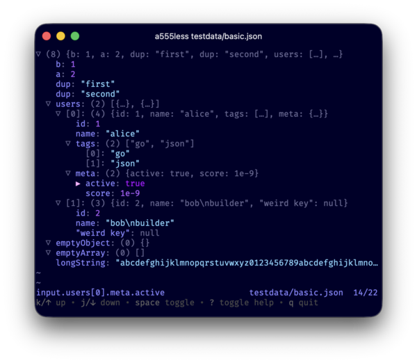

<p align="center"></p>

# a555less

A small Go terminal JSON viewer inspired by the data-mode subset of `jless`.

## Install

Nightly binaries are published to GitHub Releases for macOS and Linux (`arm64`, `amd64`):

```sh
os=$(go env GOOS); arch=$(go env GOARCH)
gh release download --repo acidghost/a555less --pattern "a555less-$os-$arch.tar.gz"
tar -xzf "a555less-$os-$arch.tar.gz"
install "a555less-$os-$arch" ~/.local/bin/a555less
```

Or build from source:

```sh
git clone https://github.com/acidghost/a555less.git
cd a555less
just install
```

## Usage

```sh
a555less file.json
a555less < file.json
a555less --version
```

## Keys

```
q, ctrl+c                 quit
j, down                   down
k, up                     up
space, enter              toggle
h, left                   collapse/parent
l, right                  expand/child
g, home                   top
G, shift+g, end           bottom
pgdown, pagedown, ctrl+f  page down
pgup, pageup, ctrl+b      page up
ctrl+d                    half down
ctrl+u                    half up
H                         parent
J                         next sibling
K                         prev sibling
c                         collapse siblings
C, shift+c                deep collapse siblings
e                         expand siblings
E, shift+e                deep expand siblings
?                         toggle help
```

## Contributing

Use `mise install` to get the pinned tools, or install Go, `just`, `golangci-lint`, `shfmt`, and `shellcheck` yourself.

```sh
just fmt
just lint
just lint-sh
just test
just build
just e2e/run   # requires tmux; run after just build
```

Keep changes small and include tests when changing parser, rendering, or navigation behavior.
